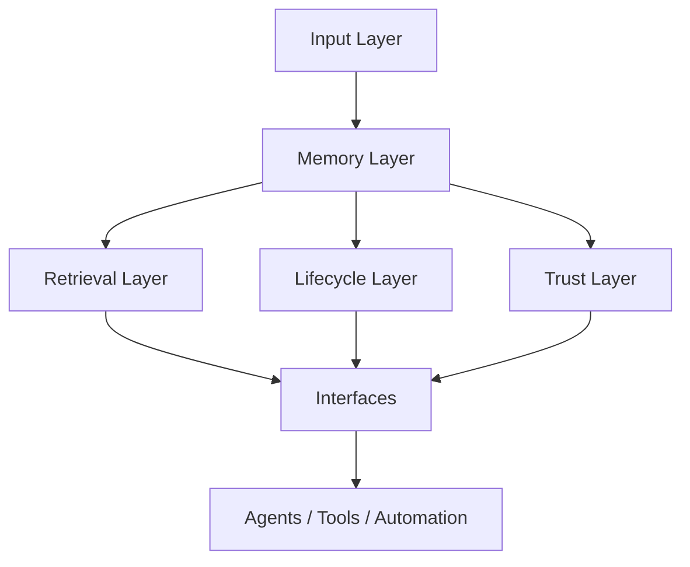

# 🧠 AndyAI Operational Memory — Architecture

AndyAI Operational Memory is a trust-aware memory substrate for AI systems that need more than retrieval.

It is designed to connect:

- **past** → what happened
- **present** → what is active now
- **direction** → what the system is trying to achieve
- **trust** → what is verified and safe to reuse
- **action** → what downstream tools and agents should do next

---

## Core formula

**Memory + State + Direction + Trust + Action**

---

## Architectural layers

### 1. Input Layer

The input layer receives raw knowledge units from humans, tools, scripts, or agents.

Typical inputs:
- decisions
- cases
- patterns
- plans
- references
- preferences

At this stage, information is **captured**, not yet trusted.

---

### 2. Memory Layer

The memory layer stores structured records with canonical metadata.

A memory record typically includes:
- type
- title
- summary
- full content
- tags
- timestamps
- status
- trust level
- authority level
- evidence links
- checksum/signature-compatible fields

This is the core substrate of the system.

---

### 3. Retrieval Layer

The retrieval layer allows the system to locate relevant records using semantic search and ranking.

It is responsible for:
- embedding-based lookup
- project-aware filtering
- relevance ranking
- returning compact result sets for agents and tools

Important principle:

**Similarity alone is not enough.**

Operational Memory uses retrieval as an entry point, not as the whole system.

---

### 4. Lifecycle Layer

Operational Memory is not a static archive.

Every important record moves through a lifecycle:

- draft
- active
- verified
- superseded
- deprecated
- archived

This allows the system to distinguish between:
- newly captured signals
- current working truth
- historical but outdated records
- archived material kept for audit or replay

---

### 5. Trust Layer

The trust layer turns memory into something that can be reviewed, promoted, exported, and verified.

It includes:
- evidence metadata
- authority levels
- promotion rules
- signed trust bundles
- replay manifests
- release discipline

This is the main differentiator between Operational Memory and ordinary memory systems.

---

### 6. Interface Layer

Operational Memory is designed to be reusable through multiple interfaces:
- CLI
- HTTP API
- automation scripts
- future MCP-compatible adapters
- future dashboard / UI layers

Knowledge should not be trapped inside one tool.

---

## Canonical design principles

### Structured, not loose
Memory should live in typed, reviewable records.

### Searchable, but also governable
Retrieval helps find records. Lifecycle and trust help decide whether they should be used.

### Portable, not trapped
Important records should be exportable as signed artifacts.

### Replayable, not mysterious
Systems should be able to re-examine prior memory states during debugging or audits.

### Compatible with agents
The memory substrate should support future agent systems without being tied to one model vendor.

---

## Current repo role

This repository currently acts as a **foundation layer** for:
- memory-aware AI systems
- trust-aware agent workflows
- replay and audit pipelines
- future AndyAI ecosystem integrations

It is best understood as a **memory infrastructure repo**, not as a chat product.

---

## Relationship to other AndyAI layers

Operational Memory is especially complementary to:
- **andyai-skill-engine** → execution structure and reusable skills
- **AGP / trust layers** → governance, trust claims, release integrity
- future orchestration layers → stateful agent behavior

In simple terms:

- `skill-engine` decides **how work is structured and executed**
- `operational-memory` decides **how knowledge is carried, trusted, and reused over time**

---

## Final architectural insight

**Semantic memory finds.**

**Operational memory carries.**

**Trust memory proves.**
