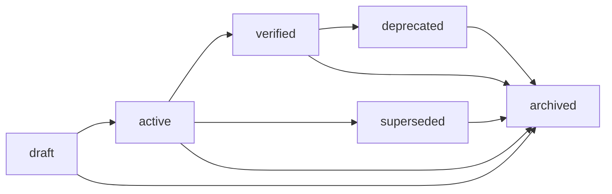

# 🔁 Memory Lifecycle

Operational Memory treats memory as a living operational asset.

A record is not simply stored forever in one flat state.
It moves through a controlled lifecycle so the system can distinguish:
- what is new
- what is currently usable
- what has been verified
- what has been replaced
- what is only retained for history or audit

---

## Lifecycle overview



---

## Stage definitions

### draft

A newly captured record.

Characteristics:
- recently inserted
- not yet approved for broad reuse
- may still be incomplete
- useful for working context, but not yet strong enough to be treated as stable truth

Examples:
- fresh project note
- early bug analysis
- initial design decision note
- imported conversational insight

Use case:
- capture signal quickly without forcing immediate trust

---

### active

A working record that is currently usable.

Characteristics:
- relevant to current execution or reasoning
- reviewed enough to be operationally useful
- not necessarily final or permanent
- should appear in normal retrieval flows

Examples:
- current workaround
- accepted short-term decision
- live plan item
- valid implementation pattern

Use case:
- day-to-day operational memory

---

### verified

A record that has stronger trust and should be prioritized when the system can choose between competing records.

Characteristics:
- reviewed or validated
- supported by evidence, authority, or verification flow
- safe to prefer in retrieval and reuse
- strong candidate for signed export and replay inclusion

Examples:
- confirmed implementation decision
- validated architecture note
- policy-approved operational pattern
- trust-backed memory record

Use case:
- high-confidence reuse

---

### superseded

A record that was once valid, but has been replaced by a newer or better record.

Characteristics:
- retained for history
- should no longer be treated as current truth
- should ideally point to the replacement record

Examples:
- old workaround replaced by final solution
- previous decision replaced by new architecture direction
- outdated plan replaced by revised roadmap

Use case:
- historical traceability without corrupting active context

---

### deprecated

A record that is still part of history, but should not normally be used for current operations.

Characteristics:
- kept for context or audit
- no longer recommended
- useful when explaining why something changed

Examples:
- retired pattern
- no-longer-approved practice
- old interface contract

Use case:
- backward explanation and audit history

---

### archived

A record that is removed from normal operational use and stored for long-term retention.

Characteristics:
- excluded from most normal retrieval paths
- preserved for history, audits, replay, or migrations
- still valuable, but not part of live working context

Examples:
- closed incident history
- old project memory set
- old release-specific records

Use case:
- retention without clutter

---

## Promotion flow

The main controlled flow is:

```text
 draft → active → verified
```

This is the core trust-building path.

The system may also move records into:
- `superseded`
- `deprecated`
- `archived`

based on new evidence, newer replacements, or lifecycle management.

---

## Why lifecycle matters

Without lifecycle, a memory system becomes a pile of semantically searchable text.

That creates several problems:
- outdated records keep reappearing
- draft notes compete with validated truth
- retrieval becomes noisy
- agents cannot reliably distinguish current context from historical residue

Lifecycle solves this by making status explicit.

---

## Retrieval implications

Lifecycle status should influence ranking and reuse.

Typical behavior:
- `verified` should usually rank above `active`
- `active` should usually rank above `draft`
- `superseded` and `deprecated` should remain visible only when useful for context
- `archived` should generally be excluded from ordinary search flows

This is why lifecycle is part of the operational model, not only documentation.

---

## Governance implications

Lifecycle also supports governance:
- promotion can require review
- verification can require evidence or authority
- superseded records preserve historical truth
- archived records support replay and audit

This is the bridge between memory and trust.

---

## Final principle

**A memory record is not just saved. It is managed.**

That is the difference between:
- ordinary memory storage
and
- Operational Memory.
