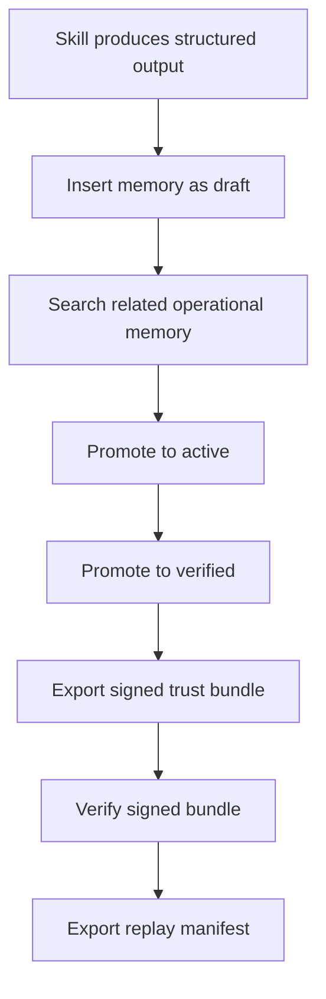

# End-to-End Example

This document explains the canonical operational-memory flow using the example in `examples/agent-continuity/`.

## Flow summary

## What this demonstrates

- how a skill hands off memory material
- how operational memory captures it in a governed way
- how promotion gates turn draft context into trusted context
- how trust artifacts make the result portable and auditable

## Why this is the right next step

After a strong architecture and trust foundation, the next credibility jump comes from a complete, reproducible workflow.

That is what this example provides.

## Recommended reading order

1. `README.md`
2. `ARCHITECTURE.md`
3. `MEMORY_LIFECYCLE.md`
4. `docs/interoperability.md`
5. `examples/agent-continuity/README.md`
6. `examples/agent-continuity/run-example.sh`

## Operator checklist

- start the local server
- insert a draft memory
- inspect retrieval results
- promote the record
- export a bundle
- verify the bundle
- export replay

If all steps succeed, the repo no longer reads as just a specification. It reads as a working operational memory system.
