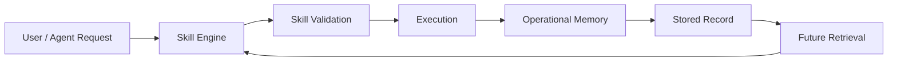

# 🔗 Interoperability — Skill Engine ↔ Operational Memory

This document describes how `andyai-skill-engine` and `andyai-operational-memory` fit together conceptually.

Even before direct runtime integration is fully implemented, the architectural relationship is already clear.

---

## Core idea

The two repositories solve different parts of the same larger problem.

### AndyAI Skill Engine
Focuses on:
- reusable skills
- validator-first execution
- packaging discipline
- export paths for downstream tooling

It answers:

**How should AI work be structured and executed?**

---

### AndyAI Operational Memory
Focuses on:
- memory continuity
- lifecycle-aware records
- trust metadata
- signed bundles
- replay manifests
- release discipline for memory artifacts

It answers:

**How should knowledge be carried, trusted, and reused over time?**

---

## Simple mental model



In plain language:
- Skill Engine performs structured work.
- Operational Memory captures important outcomes and context.
- Future executions can retrieve that context and work with continuity.

---

## Division of responsibility

| Concern | Skill Engine | Operational Memory |
|---|---|---|
| Task execution | ✅ |  |
| Skill packaging | ✅ |  |
| Validation-first workflow | ✅ |  |
| Semantic retrieval |  | ✅ |
| Lifecycle status |  | ✅ |
| Trust metadata |  | ✅ |
| Signed export artifacts |  | ✅ |
| Replay / audit memory state |  | ✅ |
| Stateful continuity across time |  | ✅ |

---

## Example future flow

A realistic future integration could look like this:

1. A skill is selected and validated in `andyai-skill-engine`
2. The skill executes a structured operation
3. The result is summarized into one or more memory candidates
4. Memory candidates are inserted into `andyai-operational-memory` as `draft` records
5. Important records are later promoted to `active` or `verified`
6. Future skills query memory before execution to recover:
   - prior decisions
   - prior blockers
   - trusted patterns
   - related evidence

This creates a loop where:
- execution generates memory
- memory improves future execution

---

## Why this matters

Without the memory layer:
- each skill run starts from a weaker context base
- important decisions are lost between sessions
- trust and history remain external to execution

Without the skill layer:
- memory remains passive
- there is no strong execution structure built on top of it

Together, they form a much stronger foundation for stateful AI systems.

---

## Candidate integration contract

A future integration contract could include fields like:

```json
{
  "project_id": "string",
  "memory_type": "decision | case | pattern | plan | reference | preference",
  "title": "string",
  "summary": "string",
  "content": "string",
  "source": "skill-engine",
  "source_ref": "skill-pack-or-run-id",
  "status": "draft",
  "trust_level": "unverified"
}
```

This would allow skill outputs to be promoted into memory without inventing ad-hoc schemas each time.

---

## Strategic value

This interoperability story is strategically important because it turns two strong standalone repositories into part of a larger ecosystem narrative:

- `skill-engine` = structured execution
- `operational-memory` = continuity and trust

That combination is much stronger than either repository in isolation.

---

## Final interoperability insight

**Skill Engine gives the system disciplined execution.**

**Operational Memory gives the system disciplined continuity.**

Together, they move AndyAI closer to a true trust-aware agent foundation.
