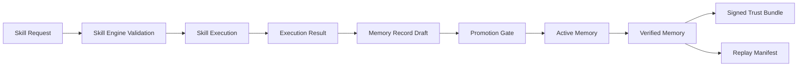

# Skill Engine ↔ Operational Memory Interoperability

## Purpose

This document defines the canonical interoperability model between:

- **andyai-skill-engine** → structured execution layer
- **andyai-operational-memory** → continuity, trust, and replay layer

Together, they form a practical foundation for trust-aware, stateful agent workflows.

---

## Core Principle

Skill Engine executes.
Operational Memory carries context, evidence, and continuity.

A skill run should not disappear after completion.
It should produce durable operational records that can be searched, promoted, verified, and replayed.

---

## Canonical Flow

---

## Integration Contract

### Skill Engine responsibilities

- validate incoming skill request
- execute skill logic deterministically where possible
- emit structured output
- include enough metadata for memory storage

### Operational Memory responsibilities

- persist execution outcome as structured record
- enforce lifecycle state transitions
- attach trust/evidence metadata
- expose retrieval, replay, and signed export

---

## Recommended Handoff Payload

A completed skill run should produce a handoff object with:

- `skill_id`
- `run_id`
- `project_id`
- `status`
- `summary`
- `result`
- `evidence`
- `recommended_memory_type`
- `recommended_tags`

See:
- `schemas/skill_memory_handoff.schema.json`
- `examples/skill-engine-integration/skill-memory-handoff.example.json`

---

## Mapping Guide

| Skill output concept | Operational Memory field |
|---|---|
| skill identifier | source_ref |
| execution summary | summary |
| full execution output | content |
| evidence / logs | evidence_url / evidence_hash |
| final status | status |
| skill category | tags |
| run identifier | related_to / source_ref |

---

## Recommended Memory Types

| Skill outcome | Memory type |
|---|---|
| stable implementation choice | decision |
| resolved operational incident | case |
| reusable execution lesson | pattern |
| future execution intention | plan |
| operator preference learned | preference |
| source material / external spec | reference |

---

## State Promotion Guidance

### Draft
Use when a skill run finished but still needs review.

### Active
Use when the output is operationally useful and can guide future runs.

### Verified
Use when the output has passed trust review and is safe to prioritize.

---

## Why this matters

Without interoperability, skill runs become isolated events.

With interoperability:
- executions become reusable history
- memory becomes operationally relevant
- trust artifacts can be generated from real work
- replay becomes possible

---

## Next Evolution

Future versions can extend this model with:
- MCP-native interoperability
- shared authority inheritance
- multi-agent shared memory streams
- skill-of-skills execution traces linked to replay manifests
